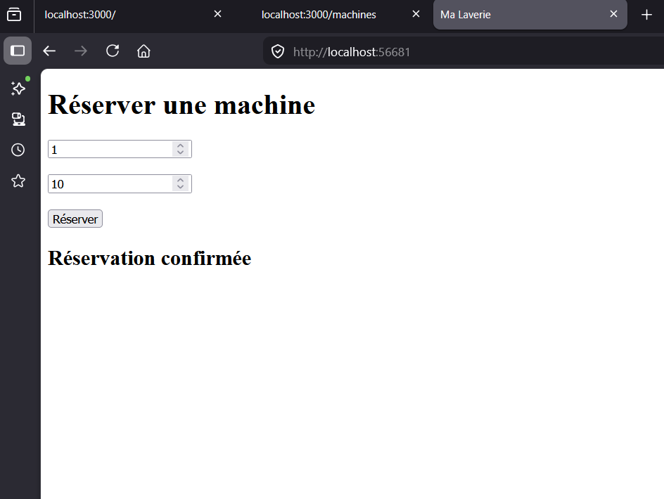
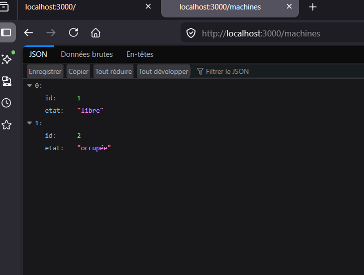

# Ma Laverie

## Description

Ma Laverie est une application web permettant de consulter l’état des machines d’une laverie et d’effectuer une réservation en ligne.

Le projet a été réalisé dans le cadre d’un projet scolaire en suivant une méthode Agile organisée en sprints.

Cette première version correspond à un MVP (Minimum Viable Product) permettant de démontrer le fonctionnement principal de l’application.

---

# Objectifs du projet

- Consulter les machines disponibles
- Réserver une machine
- Réduire le temps d’attente
- Éviter les déplacements inutiles
- Afficher l’état des machines en temps réel

---

# Utilisateurs cibles

- Étudiants
- Habitants urbains
- Personnes ne possédant pas de machine à laver

---

# Technologies utilisées

## Frontend
- HTML
- CSS
- JavaScript

## Backend
- Node.js
- Express.js

## Tests
- Jest
- Supertest

## Outils
- GitHub
- GitHub Projects
- VS Code
- Docker

---

# Structure du projet

- `index.html` : interface utilisateur
- `index.js` : serveur backend Express
- `test.js` : tests unitaires
- `package.json` : dépendances du projet
- `Dockerfile` : configuration Docker
- `README.md` : documentation du projet

Documents de conception :
- MCD
- MLD
- MPD
- Diagramme de classes
- Diagramme de séquence
- Maquettes

---
# Captures du projet

## Liste des machines



---

## Réservation confirmée



# Fonctionnalités développées

## Consultation des machines

L’utilisateur peut consulter la liste des machines disponibles via l’API.

Exemple :
```bash
GET /machines
